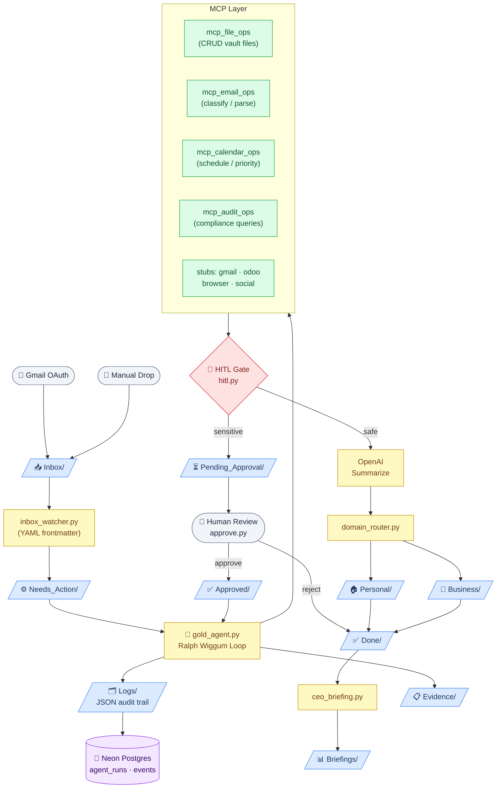

# AI Employee Vault — Architecture Diagram

> Generated: 2026-02-25T08:26:59Z

## System Flow

## Component Summary

| Component | File | Role |
|-----------|------|------|
| Gold Agent | `gold_agent.py` | Autonomous Ralph Wiggum loop |
| Inbox Watcher | `inbox_watcher.py` | Normalises Inbox/ → Needs_Action/ |
| MCP File Ops | `mcp_file_ops.py` | Vault CRUD (list/read/write/move/delete) |
| MCP Email Ops | `mcp_email_ops.py` | Classify sender, parse headers, draft reply |
| MCP Calendar Ops | `mcp_calendar_ops.py` | Schedule, prioritise, briefing-due check |
| MCP Audit Ops | `mcp_audit_ops.py` | Compliance queries, error log, summary |
| HITL Gate | `hitl.py` | Sensitive-keyword detection + approval flow |
| Domain Router | `domain_router.py` | Personal / Business classifier |
| CEO Briefing | `ceo_briefing.py` | Weekly executive markdown report |
| Audit Logger | `audit_logger.py` | Per-action JSON → Logs/ + Neon DB |
